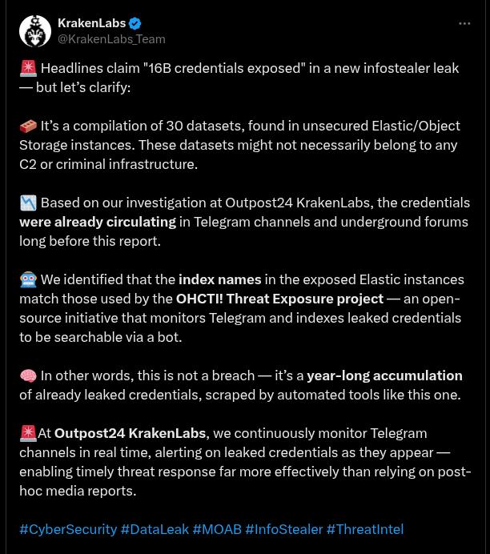

# O que tem em um vazamento de senhas?

Um vazamento de senhas contém muitas senhas usadas por pessoas reais. Às vezes estes vazamentos contém até o serviço e
os nomes de usuários e senhas usados.

## O que é em um vazamento de senhas?

Um vazamento de senhas refere-se à exposição não autorizada de credenciais de login do usuário, como nomes de usuário e
senhas.

Todo mundo já utilizou a mesma senha em vários sites. É praticamente impossível memorizar uma senha forte e distinta
para cada site ou aplicativo que usamos. Portanto, conhecer os riscos de vazamentos e agir quando eles ocorrem é
essencial para todos nós.

Embora usar gerenciadores de senha seja uma forma de mitigar os desafios de gerar senhas fortes e memorizá-las, os
gerenciadores de senhas são, eles próprios, vulneráveis a ataques cibernéticos, coisa que sua memória AINDA não é. Mesmo
que o risco seja reduzido, o próprio gerenciador de senhas é um alvo de interesse para os crackers. E se a senha mestra
do gerenciador de senhas vazar é **fim de jogo**.

## Por que isto é relevante?

Recentemente, mais de 16 bilhões de credenciais de login foram vazadas. A priori, é impossível dizer quantas pessoas ou
contas foram realmente expostas.

Neste exato momento, um arquivo compartilhado em um fórum hacker está disponível para qualquer interessado em conhecer o
que as pessoas (e isto inclui você) usam como senha.

Um vazamento de senhas é um problema relevante porque pode resultar em acesso não autorizado a informações pessoais e
confidenciais. Quando uma senha é exposta em uma violação de dados, aumenta o risco de roubo de identidade, aquisição de
contas e outras formas de crime cibernético.

## RockYou2021.txt WordList

Em meados de 2021 um usuário de um fórum hacker postou um arquivo TXT de 100 GB que contém bilhões senhas. Embora haja
vazamentos mais recentes, algumas empresas de segurança ainda consideram o vazamento de 2021 como um dos mais
relevantes, sendo os recentes nada mais que um acúmulo de credenciais previamente vazadas. Leia mais em
<https://specopssoft.com/blog/16-billion-passwords-leaked/>.

Logo, RockYou2021.txt:

- Um dos maiores vazamentos de senhas da história;
- 8,4 bilhões de entradas contendo senhas.

```sh
# Mais de 90GB de dados
$ ls -lh /dados/
total 92G
-rw-r--r-- 1 vscode vscode 92G Apr 16  2021 rockyou2021.txt

# Quase 8,5 bilhões de linhas
$ wc -l /dados/rockyou2021.txt
8459060239 /dados/rockyou2021.txt
```

## Estou seguro?

Será que eu estou neste vazamento de senhas?

```sh
# Buscar por alguma senha minha vazada
$ grep 'xxxxxx' /dados/rockyou2021.txt
# => vixe, ele achou algumas senhas antigas (mas que podem ter vazado através de outras pessoas)
# NENHUMA senha atual foi encontrada neste vazamento de 2021 (lembre-se que isto NÃO garante que não haja vazamento)
```

Contém inclusive senhas que eu já utilizei em Marketplaces por aí. Ainda, contém:

- Nomes como bradesco, junior ou roberto usados como senha;
- Nomes de cidade como jacarei ou newyork usados como senha;
- Apelidos como docinho ou dasilva usados como senha;
- Palavras de uso geral como amizade, bootcamp, caprichosa, cultura ou medicina usados como senha.

Eu resolvi buscar meu nome na lista de senhas vazada. Eis alguns exemplos do que foi encontrado:

```text
1977claudio
claudio1992
Claudio1997
Claudio93
claudioamaya
CLAUDIOTEAMO
CLAUDIOYURIIVANA
gayo.claudio
```

Além do óbvio uso do nome mais o ano de nascimento, há uma série de senhas fracas, passíveis de serem "adivinhadas" por
ex-companheiros, colegas de trabalho, entre outros.

Por fim, peguemos como exemplo `gayo.claudio`. É interessante, isto parece ser exatamente o nome de alguém. Vamos
pesquisar então:

- É! Descobri que há um médico argentino com este nome, Dr. Gayo, Claudio, atende em Buenos Aires na Av. Gaspar Campos,
  pertinho da Farmacia Pacled e do Plaza Campos Futbol 5.

Talvez o médico argentino chamado Claudio use senhas fortes e esteja protegido contra ataques, mas há algum Claudio em
algum lugar que pode não estar.

## Conclusão

É muito perigoso se sentir seguro no mundo virtual. Pessoas, empresas e equipes precisam ser conscientizados sobre os
riscos inerentes do mundo conectado em que vivemos.

Senhas que eu mesmo já usei estão disponíveis para qualquer cyber criminoso consultar livremente. O simples fato de
conhecer como as pessoas fazem as senhas já é informação relevante e suficiente para que ataques baseados em dados
estatísticos direcionados sejam possíveis e capazes de quebrar senhas de usuários reais. Leia esta citação (transcrição
livre feita por mim):

> Para decifrar uma senha usando dados estatísticos, os invasores aproveitam padrões e estruturas observados em grandes
> conjuntos de dados de senhas expostas anteriormente. Essa abordagem permite que eles prevejam estruturas de senhas
> prováveis e reduzam significativamente o espaço de chaves que precisam pesquisar.

Portanto, todos nós devemos usar MFA (autenticação multifator) em todos os sites que ofereçam esta funcionalidade. As
empresas precisam estabelecer políticas rígidas de definição e reciclagem de senhas. Ainda, os administradores de
servidores e de usuários devem auditar regularmente, de forma segura e garantindo que os bancos de dados de senhas nunca
saiam dos servidores, as senhas sobre sua tutela (usando para isto programas de auditoria de senhas como o
`John the Ripper`).

Por fim, todos nós precisamos ser pró-ativos e vigilantes no mundo virtual. E adotar práticas recomendadas, como o uso
de senhas únicas e fortes e a autenticação multifator.

## Apêndice

### [1] Avaliação do KrakenLabs sobre o vazamento de Junho de 2025



Resumo da avaliação feita pelo KrakenLabs postada em uma rede social.

### [2] Estatística para Quebrar Senhas

Vários algorítimos famosos podem ser quebrados por força bruta (ou busca exaustiva de chave que consiste na verificação
sistemática de todas as possíveis chaves e senhas até que as corretas sejam encontradas) se o atacante possuir poder de
processamento suficiente. E por suficiente estamos pensando em algo que empresas e governos podem comprar (ou alugar).

Leia mais em <https://www.praetorian.com/blog/statistics-will-crack-your-password-mask-structure/>.
